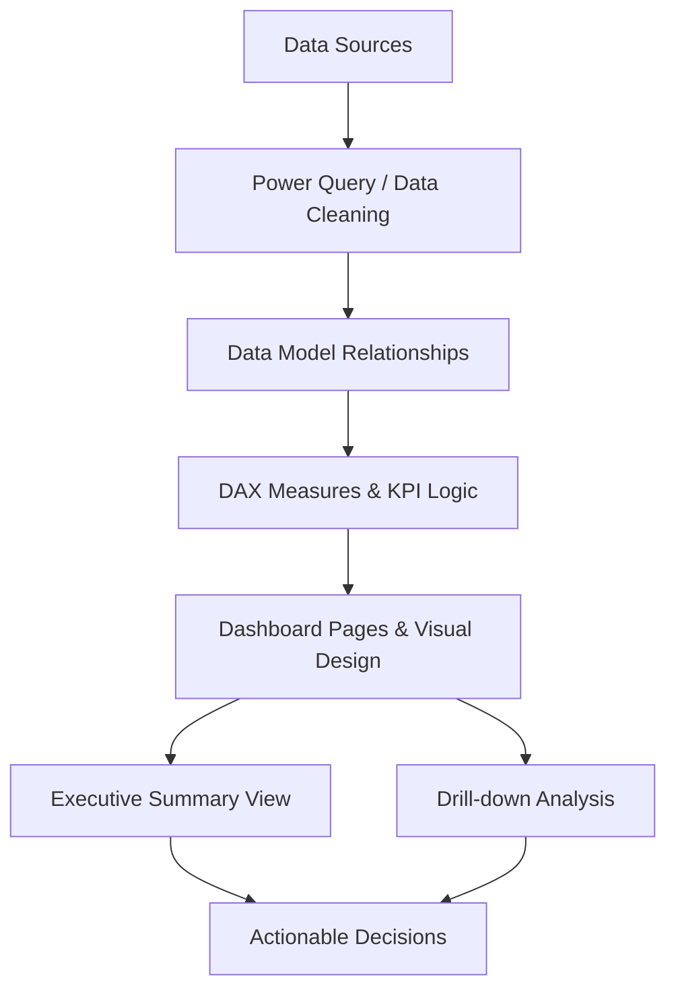
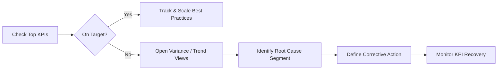

# Finance Dashboard (Power BI)

A recruiter-friendly, business-focused Power BI project showcasing how finance data can be transformed into decision-ready insights for leadership, FP&A, and operations teams.

---

## 🔗 Live Dashboard
**Power BI Report Link:**  
<https://app.powerbi.com/groups/me/reports/c82fd87d-e228-4da4-a08b-ce6e57d2a020/a873e7d668b2bd839738?experience=power-bi&ownerId=8647d4d1-04d0-4c1a-8a4f-bf49d3e82ad6&referrer=embed.appsource>

> If the report requires sign-in/tenant access, request viewer permissions from the owner account.

---

## 🚀 Project Snapshot
This dashboard is designed to help stakeholders quickly identify:
- **Financial strengths** (what is performing well),
- **Pain points** (cost/revenue/profitability pressure areas),
- **Actionable opportunities** (where to intervene for better outcomes).

It is positioned as an executive-ready BI solution with drill-down capability for analysts and managers.

---

## 🎯 Business Goals
- Provide a single, trusted view of core finance KPIs.
- Improve speed of monthly/quarterly performance reviews.
- Surface variance drivers early (actuals vs target/budget).
- Enable data-backed prioritization across products, regions, or business units.

---

## 📊 Typical KPI Coverage (Finance Dashboard Pattern)
The dashboard experience is structured around common finance KPIs such as:
- Revenue
- Cost / Expense
- Gross Profit / Net Profit
- Margin %
- Budget vs Actual variance
- Trend over time (MoM/QoQ/YoY)

---

## 🧭 User Journey / Analysis Flow

---

## 🧠 Decision-Making Flow (How stakeholders use it)

---

## 🛠️ Tools & Skills Demonstrated
- **Power BI** (report building, interactive visuals)
- **Data Modeling** (table relationships, star-schema thinking)
- **DAX** (KPI calculations, business logic measures)
- **Storytelling with Data** (executive narrative + drill-down path)
- **Finance Analytics** (variance, profitability, trend analysis)

---

## 👔 Recruiter Notes (Why this project stands out)
This project demonstrates practical BI capabilities valued in Analyst / BI / FP&A roles:
- Translating business questions into dashboard logic.
- Designing KPI-first interfaces for non-technical users.
- Building decision workflows, not just charts.
- Communicating findings through structured visual narratives.

---

## 📁 Repository Contents
- `README.md` — project overview, dashboard context, and usage.
- `Dashboard_Link` — direct Power BI report URL reference.

---

## 📌 Suggested Next Enhancements
- Add static screenshots/GIF walkthroughs of report pages.
- Add a short data dictionary (metric definitions).
- Add DAX measure documentation for reproducibility.
- Add a “Business Impact” section with before/after outcomes.

---

## 🙋 Contact / Collaboration
If you are a recruiter, hiring manager, or collaborator interested in finance analytics, BI dashboards, or FP&A reporting workflows, feel free to connect.
